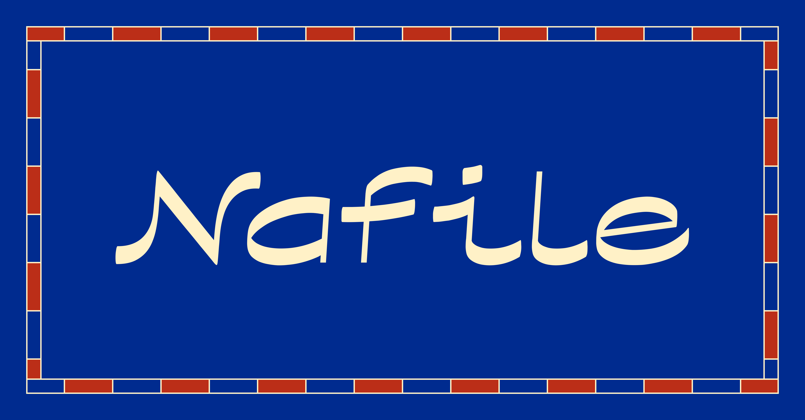

# Nafile

[](https://nafile.ertekin.xyz)

Nafile is a modern-arabesque display typeface,
offering a vast and versatile family with 6 widths and 5 weights, all in a variable, open-source format. The project was born in Barcelona, inspired by the city where the initial sketches came to life. I was moved by the way Barcelona’s Gothic roots, Catalan modernism, Mediterranean charm, and touches of Arabesque all blended into the city’s modern rhythm. This unique mix of influences became the heart of the typeface.

All weights, widths, and styles of the Nafile typeface can be tested on [nafile.ertekin.xyz](https://nafile.ertekin.xyz)


## Building the Fonts

The font is built using fontmake and gftools post processing script. Tools are all python based, so it must be previously installed.

To install all the Python tools into a virtualenv, do the following:

From terminal:

```
cd your/local/project/directory
```

once in the project folder create a virtual environment. 
This step has to be done just once, the first time:

```
python3 -m venv venv
```

activate the virtual environment

```
source venv/bin/activate
```

install the required dependencies

```
pip install -r requirements.txt
```

Then run the this command:

```
cd source
sh build.sh
```

## License

Nafile is licensed under the SIL Open Font License v1.1, see [OFL.txt](OFL.txt) for details.
